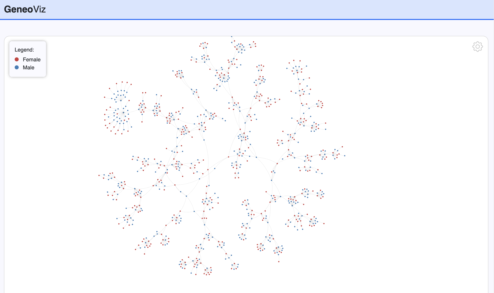
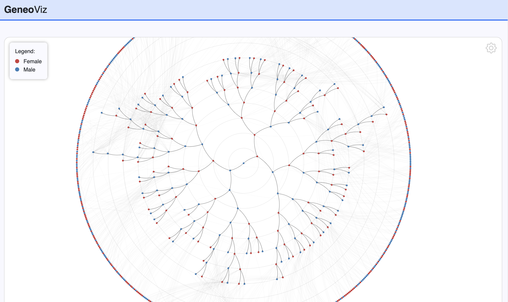

# Genealogy graph visualization

This is a visualization tool for GEDCOM data.
It is built with [Vue.js](https://vuejs.org/) and [D3.js](https://d3js.org/).

The application loads a GEDCOM file and creates a graph of the family tree.
The graph can be explored by clicking on the nodes.

Currently, the application is not available online, however, it can be run locally and we are working on a deployment.

## Authors
- Norbert Vígh @VighNorbert

## Acknowledgements
This project is a fork of [the migration graph visualization](https://github.com/VighNorbert/migrations) project by 
- Norbert Vígh @VighNorbert, 
- Hanna Balaka @Annchovy and
- Daniele Fippi @phi998.

## Graph visualizations
The application supports two different graph layouts.
The setup of the forces can be adjusted in the settings menu in the top right corner.

### Force-directed graph
This layout creates a force-directed graph of the whole family tree. It includes all relationships (husband-wife and parent-child).


### Radial-layout graph
Can be accessed by clicking on a node. This node becomes the new root node of this layout.
Only the ancestors of the root node are shown.


## Project setup
```shell
npm install
```

### Compiles and hot-reloads for development
```shell
npm run serve
```

### Compiles and minifies for production
```shell
npm run build
```

### Lints and fixes files
```shell
npm run lint
```
